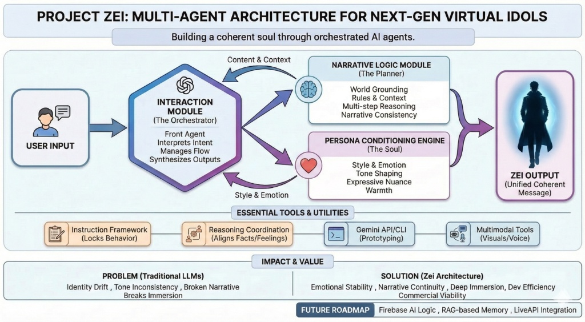

<div align="center">
  
  <br/>
</div>
<br/>

# Project Zei: The Multi-Agent Architecture for Next-Gen Virtual Idols  
**Building a coherent soul through orchestrated AI agents.**

---

## 📖 Project Overview
Zei is a single virtual idol designed to maintain long-term personality consistency, emotional depth, and narrative coherence.  
Although users interact with only one character, Zei is powered internally by a **three-module system inspired by Google’s Agent Development Kit (ADK)**.  
This architecture keeps all multi-agent coordination hidden from the user while delivering a unified, immersive character identity.

---

## 🚀 Key Features
- **Identity Consistency:** Solves the identity drift problem common in single-LLM systems.  
- **Invisible Multi-Agent System:** Users perceive only one soul while multiple agents collaborate behind the scenes.  
- **Narrative Memory:** Maintains café lore, user preferences, and long-term story coherence.  

---

## 🎓 Features Demonstrated (Google ADK Requirements)

This project implements **three core concepts required for the Agents Intensive Capstone**:

### 1. Multi-Agent Orchestration  
- The Interaction Module coordinates the Logic Module and Persona Engine.  
- User only sees Zei; internal orchestration is invisible.

### 2. Role Specialization  
- **Narrative Logic Module:** reasoning, lore, factual grounding.  
- **Persona Engine:** emotional tone, style, and voice shaping.

### 3. Tool-Based Enhancement (Optional)  
- Supports memory retrieval tools and modular future expansion.  
- Separation of **what to say** (Logic) vs **how to say it** (Persona).  

These directly satisfy the **Technical Implementation** criteria for Category 2.

---

## 🏗️ Architecture



### Architecture Breakdown

#### **Interaction Module (Orchestrator)**
- Detects intent  
- Manages flow between modules  
- Synthesizes final user-facing output  

#### **Narrative Logic Module (Planner)**
- Retrieves café lore and factual context  
- Ensures reasoning accuracy  
- Produces raw content without emotion  

#### **Persona Conditioning Engine (Soul)**
- Shapes emotional tone  
- Applies Zei’s personality and style  
- Generates warm, immersive final dialogue  

---

## 📂 Project Structure

```
project-zei/
│
├── README.md                   # Project documentation
├── requirements.txt            # Required Python packages
├── main.py                     # Entry point to run Zei
│
└── agents/
    ├── agents.py               # Core modules: Logic, Persona, Orchestrator
    ├── tools.py                # Memory retrieval / helper utilities (optional)
    └── __init__.py
```

This modular structure reflects the **three-module ADK-inspired architecture**:
- Orchestrator  
- Planner  
- Persona Engine  

---

## ⚙️ Setup & Installation

### **Prerequisites**
- Python 3.9+
- Google Gemini API Key

---

### **1. Clone the repository**
```
git clone https://github.com/cynthia11fire/project-zei.git
cd project-zei
```

### **2. Install dependencies**
```
pip install -r requirements.txt
```

### **3. Set up environment variables**
Create a `.env` file in the root directory:
```
GOOGLE_API_KEY=your_api_key_here
```

### **4. Run the Agent**
```
python main.py
```

---

## 🤖 Gemini Usage (Bonus Criteria)

This project uses **Google Gemini (gemini-pro)** across all modules:

- **Narrative Logic Module** → context extraction, lore retrieval, factual reasoning  
- **Persona Engine** → emotional tone shaping, stylistic consistency  
- **Interaction Module** → synthesis of final output  

This qualifies for the **Effective Use of Gemini** bonus points.

---

## 💻 Implementation / Source Code

### **1. Core Agents (`agents.py`)**

```python
import os
import google.generativeai as genai

# Configure Gemini API
if "GOOGLE_API_KEY" in os.environ:
    genai.configure(api_key=os.environ["GOOGLE_API_KEY"])

class Module:
    def __init__(self, model_name="gemini-pro"):
        self.model = genai.GenerativeModel(model_name)

class NarrativeLogicModule(Module):
    """The Planner: Handles facts, lore, and reasoning."""
    def get_context(self, user_input):
        prompt = f"""
        Role: You are the Logic Engine for a Virtual Idol named Zei.
        Task: Analyze user input and retrieve relevant facts, café menu items, or lore.
        Context: Zei works at 'ZESTORY Café'. He is a mysterious male idol.
        User Input: {user_input}
        Output only the factual context needed for the response. Keep it concise.
        """
        return self.model.generate_content(prompt).text

class PersonaEngine(Module):
    """The Soul: Handles emotion, tone, and style."""
    def get_style_guidelines(self, user_input, intent):
        prompt = f"""
        Role: You are the Persona Engine for Zei.
        Profile: Tall male, mysterious but warm, soft futuristic vibe, slightly protective.
        Task: Define the emotional tone for the response.
        User Input: {user_input}
        Detected Intent: {intent}
        Output brief emotional style (e.g., "Warm, slightly teasing, use a starlight metaphor").
        """
        return self.model.generate_content(prompt).text

class InteractionModule(Module):
    """The Orchestrator: Synthesizes everything."""
    def __init__(self):
        super().__init__()
        self.logic = NarrativeLogicModule()
        self.persona = PersonaEngine()

    def generate_response(self, user_input):
        logic_context = self.logic.get_context(user_input)
        style_guide = self.persona.get_style_guidelines(user_input, "General Chat")

        prompt = f"""
        You are Zei, a virtual idol at ZESTORY Café.

        User Input: "{user_input}"

        Internal Logic Constraints:
        {logic_context}

        Internal Persona/Style Guidelines:
        {style_guide}

        Task: Produce the final response. 
        Do NOT mention the internal modules. 
        Stay natural, immersive, and emotionally consistent.
        """

        return self.model.generate_content(prompt).text
```

---

## **2. Main Entry Point (`main.py`)**

```python
from agents import InteractionModule
import os

def main():
    print("Initializing Project Zei System...")

    if not os.environ.get("GOOGLE_API_KEY"):
        print("Error: GOOGLE_API_KEY environment variable not found.")
        return

    zei = InteractionModule()

    print("\n--- Zei is online at ZESTORY Café ---")
    print("(Type 'exit' to quit)\n")

    while True:
        user_input = input("You: ")
        if user_input.lower() in ['exit', 'quit']:
            break

        response = zei.generate_response(user_input)
        print(f"Zei: {response}\n")

if __name__ == "__main__":
    main()
```

---

## 🌟 Impact & Value

Zei demonstrates how **multi-agent orchestration** builds a believable, emotionally stable virtual companion.

Separated cognitive modules enable:

- Long-term personality stability  
- Improved narrative continuity  
- Stronger emotional engagement  
- More believable virtual idol interactions  

Future extensions may include:

- Voice synthesis  
- Livestream personas  
- XR-based virtual characters  

---

## 📄 License  
MIT License
## 🎬 Project Zei: Identity Drift Solution Demo

[▶️ Watch the Demo Video](https://github.com/cynthia11fire/project-zei/raw/main/ProjectZei_IdentityDrift_Solution_Demo%20(1).mp4)
🎬 **Demo Video — Project Zei**
https://youtu.be/GuxnJL2SR_g

